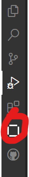
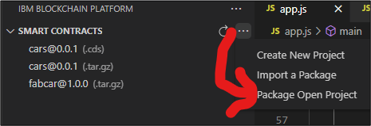

# Hyperledger Fabric Blockchain Demo
This repository provides samples to use for experimenting with Hyperledger Fabric. For this demo, you will use the following tools:
* Visual Studio Code: https://code.visualstudio.com/
* IBM Blockchain Platform: https://cloud.ibm.com/docs/blockchain?topic=blockchain-ibp-saas-pricing#ibp-saas-pricing-free. Use the free version for 30 days
* Follow these instructions to build your network: https://cloud.ibm.com/docs/blockchain?topic=blockchain-ibp-console-build-network

## Preparing Your Network
Smart Contracts are more easily deployed through the IBM Cloud Console, but, unfortunately, the default ordering service deploys with version 1.4 instead of 2.0. You will first need to correct this before deploying a smart contract on the IBM Cloud Console.
1.	Go to your IBM Blockchain Platform cloud console. Under nodes, click on _Ordering Service_, then click on _Settings_, and under _Actions_, click _Channel Capabilities_. Change the _Orderer Capability_ and _Channel Capability_ to version 2.0.0 and click _Update Capabilities_.
2.	 You will now need to commit these changes. To do so, click on _Channels_ --> _Channel 1_ and click Settings.
    a.	Select the _Org1 MSP_ and make sure to select the _org1admin_ identity that will be used to update the channel.
    b.	Continue clicking _Next_, accepting the defaults, until you get to _Capabilities_. Then update the Application, Orderer, and Channel Capabilities to 2.0.0.
    c. Continue clicking _Next_ without any changes except specifying the _Ordering Service Signature_ as the _Ordering Service MSP_. Then click _Update Channel_
    d.	You will receive a notification to approve this update on the upper right-hand side of the application. Click _Next_ to approve, and select the _Ordering Service CA Admin_. Then click to _Approve_.
    e. Then you will receive another notification to sign the channel configuration update. Select the _Org1 MSP_ and admin identity _org1admin_ to submit the channel update.

## Deploying your Smart Contract
Follow these steps to deploy a smart contact onto your IBM Blockchain Platform channel.

### Step 1: Package your Samrt Contract
In this step, you will use Visual Studio Code. Then search the Marketplace for _IBM Blockchain Platform_ and install the extension. Click on the icon shown in the following figure shown in the following figure: 

Open the [fabcar](chaincode/fabcar) directory in VS Code. This is an example smart contract from the IBM samples that you can install on your Blockchain Channel.

From the VS Code Extension for the IBM Blockchain, you will only use the Smart Contracts. Click to Package Open Project as shown in the following image: 

When prompted during packaging, select tar.gz (V2 channel capabilities). Once the packaging completes, you should see the asset you created (e.g., fabcar.tar.gz)). Click to export this tar.gz file. The file will be used in the next step.

### Step 2: Propose the Smart Contract
Go back to your cloud IBM Blockchain Platform and click on _Channels --> channel1 (Ordering Service)_. Note, that the primary tools menu also has a _Smart Contracts_ menu item, but this will not work. It's for an older version of Hyperledger Fabric.

In the channel, click to _Propose smart contract definition_. Then select the organization (i.e., Org1 MSP), and make sure to use a valid admin identity. This will need to be a user with the type _Admin_ (i.e., org1admin). From here, upload the smart contract (i.e., fabcar.tar.gz) from step 1. Accept all defaults and then click _Propose_.

### Step 3: Commit the Smart Contract
At this point, the contract is proposed to the channel, but each organization that's a part of the channel needs to commit the smart contract. If you use the sample scenario, this will only be Org1.

Still from the _Channels --> channel1 (Ordering Service)_, click on the new smart contract and go through the steps to deploy the contract for _Org1_. Once this has successfully deployed, you should be able to see the new contract on the organization's peer. You are now ready to use the smart contract!

### Step 4: Invoke the Smart Contract
Before invoking the smart contract, you'll need both a gateway definition and a user file in your wallet. First, to get the gateway definition, go back to the cloud IBM Blockchain Platform, and click on _Organizations --> Org1 MSP_. Click to _Create connection profile_.

Here you will select the peers to include (e.g., Peer1 in the simple example) and keep the _Include Org1 CA_ checked. Click, to _Download connection profile_ and save this file under the [gateway](gateway) directory. Make sure to call this file `org1msp_profile.json`.

To begin testing the invocation, use the code in [cars-test](cars-test). Open this directory in VS-Code and run `npm install` from the terminal. You will first want to run enrollUser.js (e.g., `node enrollUser.js`), but before running this, you'll need to substitute the address for `ccp.certificateAuthorities`. Open `org1msp_profile.json` in a text editor, and find `certificateAuthorities` for _organizations --> org1msp_.  In [enrollUser.js](cars-test/enrollUser.js), replace `169.51.205.58:30181` with what you find from the connection profile. Now, you should be able to run enrollUser.js without any issue.

Finally, you can use [app.js](cars-test/app.js) to test the invocation of your smart contract. Make sure to perform the same `certificateAuthorities` replacement that you did for enrollUser.js.

